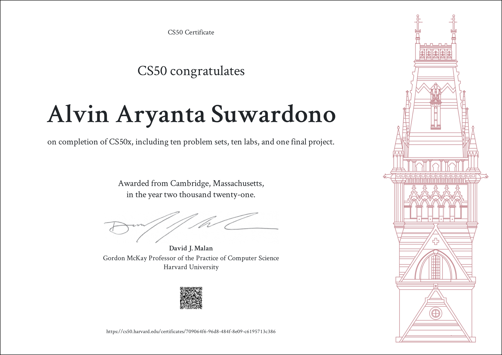

## Hello!
==============================
### An aspring game developer and programmer.
I'm an informatics engineering student. Still learning the ropes about software development.

## Languages
==============================
- C
- C++
- CSS
- HTML
- JavaScript
- SQL (MySQL, Oracle)
- PHP
- Python
- Shell

## Skill
===============================
- Arduino
- LaTeX
- Linux
- LMMS (music production)

## Certificates
===============================
- [CS50x 2021](https://cs50.harvard.edu/certificates/709064f6-96d8-484f-8e09-c6195713c386)

